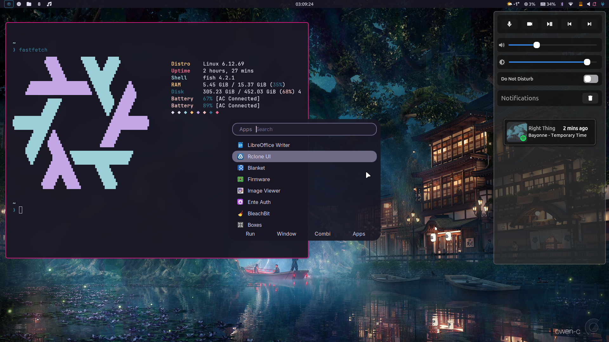

# NixOS Configuration



This repository contains the configuration files for NixOS. The app configuration files are managed via home manager as a NixOS module.

```bash
[peaceofsense@nixos:/etc/nixos]$ ls -l /etc/nixos
total 16K
drwxr-xr-x  2 root root 4,0K  7. Sep 12:29 ./
drwxr-xr-x 35 root root 4,0K  7. Sep 12:29 ../
lrwxrwxrwx  1 root root   55  7. Sep 12:29 configuration.nix -> /home/peaceofsense/nixos-config/nixos/configuration.nix
lrwxrwxrwx  1 root root   74  7. Sep 12:29 configuration.nix.bak.20240907083511 -> /home/peaceofsense/nixos-config/nixos/configuration.nix.bak.20240907083511
lrwxrwxrwx  1 root root   47  7. Sep 12:29 fonts.nix -> /home/peaceofsense/nixos-config/nixos/fonts.nix
lrwxrwxrwx  1 root root   64  7. Sep 12:29 hardware-configuration.nix -> /home/peaceofsense/nixos-config/nixos/hardware-configuration.nix
lrwxrwxrwx  1 root root   50  7. Sep 12:29 pipewire.nix -> /home/peaceofsense/nixos-config/nixos/pipewire.nix
'''
```
